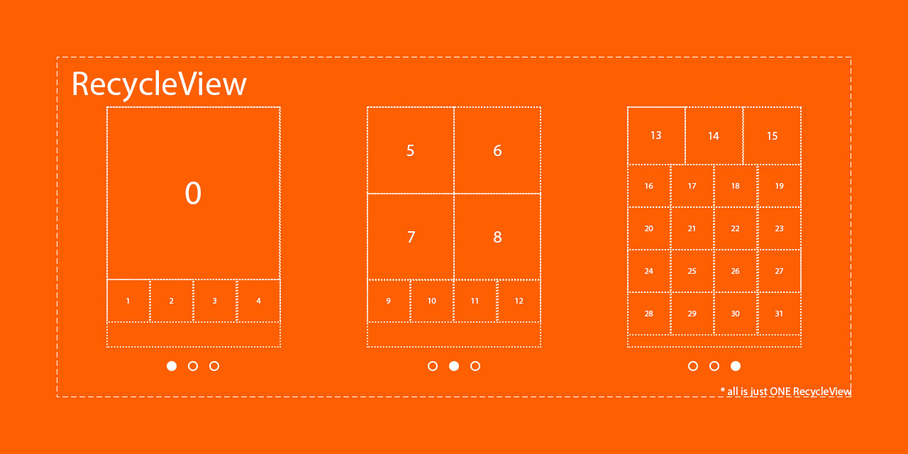
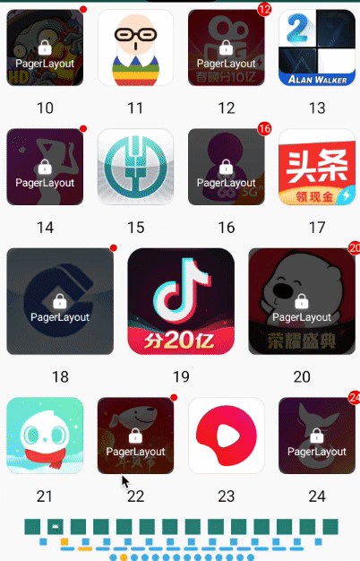

> combine PagerView + GridLayout to PagerLayout




[  ](https://bintray.com/beijingqicode/maven/LockItem/_latestVersion)


# LockItem

> this can be used in [PagerLayout](https://github.com/o0starshine0o/PagerLayout)

# Quick View



# Install
Please using latest version:

0. [LockItem](https://github.com/o0starshine0o/PagerLayout/LockItem/):
```
// 加锁红点item
implementation 'com.github.qicodes:lockitem:1.0.0'
```

# Lock && Dot
Each item can be covered with lock and dot, and the number in dot, here is a [Demo](https://github.com/o0starshine0o/PagerLayout/blob/master/app/src/main/java/com/abelhu/SlideAdapter.kt)
```kotlin
lockItem.showNumber = false
lockItem.dotNumber = -1
lockItem.showLock = false
```

Also, you can control this with xml:
```xml
<com.abelhu.lockitem.LockItem
    android:id="@+id/iconView"
    android:layout_width="0dp"
    android:layout_height="0dp"
    android:padding="8dp"
    android:src="@color/colorAccent"
    app:cornerSize="8dp"
    app:dotBackgroundColor="@android:color/white"
    app:dotBackgroundRadio="0.5dp"
    app:dotBigRadio="8dp"
    app:dotNormalRadio="4dp"
    app:dotNumber="88"
    app:dotTextSize="12sp"
    app:layout_constraintDimensionRatio="w, 1:1"
    app:layout_constraintEnd_toEndOf="parent"
    app:layout_constraintStart_toStartOf="parent"
    app:layout_constraintTop_toTopOf="parent"
    app:lock="@mipmap/icon_lock"
    app:lockBackgroundColor="#aa000000"
    app:lockHeight="23.5dp"
    app:lockText="@string/app_name"
    app:lockTextColor="@android:color/white"
    app:lockTextMargin="8dp"
    app:lockTextSize="12sp"
    app:lockWidth="21dp"
    app:showLock="true"
    app:showNumber="true"
    app:srcCompat="@drawable/ic_launcher_foreground"
    tools:ignore="ContentDescription" />
```

# Demo
This project can be run if download.
