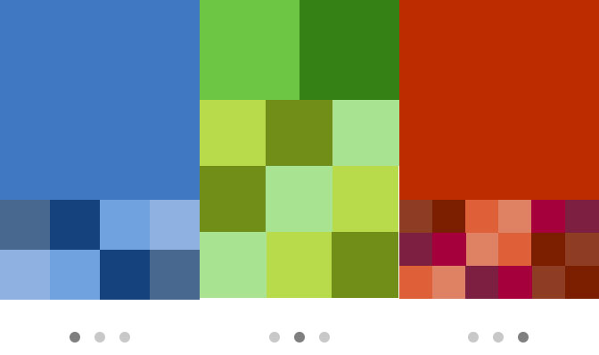

# PagerLayout

what we can do...
* replace "viewPager>recyclerView" with just only a "RecyclerView"
* reduce memory using by cache all items
* grid layout support
* custom indicator drawable support

# Quick View


# Install
Please using latest version:

0. pagerlayout:
```xml
// 翻页网格布局，本地或者网络库
implementation 'com.github.qicodes:pagerlayout:1.0.0'
```

# How To Use

1. add `PagerLayoutManager` as `recyclerView`'s `layoutManager`
```kotlin
recyclerView.layoutManager = PagerLayoutManager()
```
2. set a `adapter` to `recyclerView` as usual
```kotlin
recyclerView.adapter = SlideAdapter(baseContext)
```
3. set `PagerSnapHelper` to scroll like a `PageView`
```kotlin
PagerSnapHelper().attachToRecyclerView(recyclerView)
```

That's all!
We will layout all children automatically using pager grid.

4. if you want a indicator , we supply **4** kind indicators as implements of `PageIndicator`. **Dot**, **Line**， **Square**, **Drawable**. 
just need a `attachToRecyclerView`.
```kotlin
dotIndicator.attachToRecyclerView(recyclerView)
lineIndicator.attachToRecyclerView(recyclerView)
lineIndicator2.attachToRecyclerView(recyclerView)
drawIndicator.attachToRecyclerView(recyclerView)
```

# What's More

## PagerLayout

### Custom Grid
> just like `GridLayoutManager` you can set the grid weights of each item

The default `spanCount` is `12`, you can using this to layout children by all (1,2,3,4,6,12). Also you can custom this `spanCount`. 
Here is a simple example with kotlin code:
```kotlin
recyclerView.layoutManager = PagerLayoutManager(12) {
    when (it) {
        37 -> SlideAdapter.TYPE_1
        in 0..1 -> SlideAdapter.TYPE_2
        in 18..20 -> SlideAdapter.TYPE_3
        in 46..51 -> SlideAdapter.TYPE_6
        in 56..58 -> SlideAdapter.TYPE_3
        else -> SlideAdapter.TYPE_4
    }
}
```

### Cache Item By Type
Control to cache item just like `RecyclerView` for each type of item.
```kotlin
recyclerView.recycledViewPool.setMaxRecycledViews(SlideAdapter.TYPE_6, 20)
recyclerView.recycledViewPool.setMaxRecycledViews(SlideAdapter.TYPE_4, 20)
recyclerView.recycledViewPool.setMaxRecycledViews(SlideAdapter.TYPE_3, 4)
recyclerView.recycledViewPool.setMaxRecycledViews(SlideAdapter.TYPE_2, 4)
recyclerView.recycledViewPool.setMaxRecycledViews(SlideAdapter.TYPE_1, 4)
```

## Indicator

You can set `width`, `height`, `normalColor`, `selectColor`, `padding`, `round` to `indicator`. 
Also you can set a **`Bitmap`** as `indicator`
```xml
android:padding="8dp"
app:indicatorHeight="26dp"
app:indicatorWidth="26dp"
app:normalColor="@android:color/holo_blue_light"
app:selectColor="@android:color/holo_orange_light"
app:round="true"
```
For detail config, here is a [Demo](https://github.com/o0starshine0o/PagerLayout/blob/master/app/src/main/res/layout/activity_main.xml) for you.


# Demo
This project can be run if download.

# Donate
If this Weight helps you , I'll happy if you notify me by donate:


