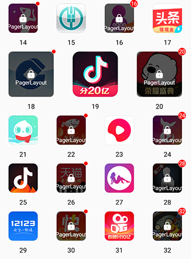
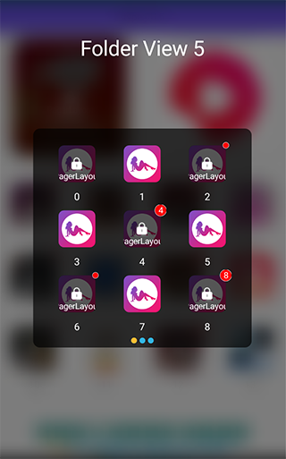

> combine PagerView + GridLayout to PagerLayout


[  ](https://bintray.com/beijingqicode/maven/PagerLayout/_latestVersion)


# PagerLayout

what we can do...
* replace "viewPager>recyclerView" with just only a "RecyclerView"
* reduce memory using by cache all items
* grid layout support
* custom indicator drawable support
* add lock, dot and corner for each item
* add NineDrawable and FolderView for Folder Like Group just like iOS
* add Guide View if you want to guide people how to use

# Quick View





# Install
Please using latest version:

0. [PagerLayout](https://github.com/o0starshine0o/PagerLayout):
1. [LockItem](https://github.com/o0starshine0o/PagerLayout/tree/master/LockItem/):
2. [Guide](https://github.com/o0starshine0o/PagerLayout/tree/master/Guide/):
3. [FolderView](https://github.com/o0starshine0o/PagerLayout/tree/master/FolderView/):
4. [NineDrawable](https://github.com/o0starshine0o/PagerLayout/tree/master/NineDrawable/):
```
// 翻页网格布局，本地或者网络库
implementation 'com.github.qicodes:pagerlayout:1.0.0'
// 加锁红点item（可选：如果需要加锁或者红点可以添加）
implementation 'com.github.qicodes:lockitem:1.0.0'
// 新手引导，（可选：如果需要添加用户引导可以添加）
implementation 'com.github.qicodes:guide:1.0.0'
// iOS风格文件夹，（可选：如果需要添加类似iOS风格的文件夹效果可以添加）
implementation 'com.github.qicodes:folderview:1.0.0'
// 生成九宫格的drawable，（可选：如果需要添加类似iOS风格的文件夹效果可以添加）
implementation 'com.github.qicodes:ninedrawable:1.0.0'
```

# How To Use

1. add `PagerLayoutManager` as `recyclerView`'s `layoutManager`
```kotlin
recyclerView.layoutManager = PagerLayoutManager()
```
2. set a `adapter` to `recyclerView` as usual
```kotlin
recyclerView.adapter = SlideAdapter(baseContext)
```
3. set `PagerSnapHelper` to scroll like a `PageView`
```kotlin
PagerSnapHelper().attachToRecyclerView(recyclerView)
```

That's all!
We will layout all children automatically using pager grid.

4. if you want a indicator , we supply **4** kind indicators as implements of `PageIndicator`. **Dot**, **Line**， **Square**, **Drawable**. 
just need a `attachToRecyclerView`.
```kotlin
dotIndicator.attachToRecyclerView(recyclerView)
lineIndicator.attachToRecyclerView(recyclerView)
lineIndicator2.attachToRecyclerView(recyclerView)
drawIndicator.attachToRecyclerView(recyclerView)
```
5. if you need your item in `RecyclerView` with lock or dot, you can implementation `lockitem`, follow [this link to see LockItem](https://github.com/o0starshine0o/PagerLayout/tree/master/LockItem/)

6. if you need a gray transparent layer to guide user, follow [this link to see Guide](https://github.com/o0starshine0o/PagerLayout/tree/master/Guide/)

7. if you need a folder view, click it to open sub-file items, just like iOS, follow [this link to see FolderView](https://github.com/o0starshine0o/PagerLayout/tree/master/FolderView/) and [this link to see NineDrawable](https://github.com/o0starshine0o/PagerLayout/tree/master/NineDrawable/)
# What's More

## PagerLayout

### Custom Grid
> just like `GridLayoutManager` you can set the grid weights of each item

The default `spanCount` is `12`, you can using this to layout children by all (1,2,3,4,6,12). Also you can custom this `spanCount`. 
Here is a simple example with kotlin code:
```kotlin
recyclerView.layoutManager = PagerLayoutManager(12) {
    when (it) {
        37 -> SlideAdapter.TYPE_1
        in 0..1 -> SlideAdapter.TYPE_2
        in 18..20 -> SlideAdapter.TYPE_3
        in 46..51 -> SlideAdapter.TYPE_6
        in 56..58 -> SlideAdapter.TYPE_3
        else -> SlideAdapter.TYPE_4
    }
}
```

### Cache Item By Type
Control to cache item just like `RecyclerView` for each type of item.
```kotlin
recyclerView.recycledViewPool.setMaxRecycledViews(SlideAdapter.TYPE_6, 20)
recyclerView.recycledViewPool.setMaxRecycledViews(SlideAdapter.TYPE_4, 20)
recyclerView.recycledViewPool.setMaxRecycledViews(SlideAdapter.TYPE_3, 4)
recyclerView.recycledViewPool.setMaxRecycledViews(SlideAdapter.TYPE_2, 4)
recyclerView.recycledViewPool.setMaxRecycledViews(SlideAdapter.TYPE_1, 4)
```

OR using one `recycledViewPool` to cache all items
```kotlin
recyclerView.recycledViewPool.setMaxRecycledViews(0, 30)
```

## Indicator

You can set `width`, `height`, `normalColor`, `selectColor`, `padding`, `round` to `indicator`. 
Also you can set a **`Bitmap`** as `indicator`
```
android:padding="8dp"
app:indicatorHeight="26dp"
app:indicatorWidth="26dp"
app:normalColor="@android:color/holo_blue_light"
app:selectColor="@android:color/holo_orange_light"
app:round="true"
```
For detail config, here is a [Demo](https://github.com/o0starshine0o/PagerLayout/blob/master/app/src/main/res/layout/activity_main.xml) for you.

## Lock && Dot
Each item can be covered with lock and dot, and the number in dot, here is a [Demo](https://github.com/o0starshine0o/PagerLayout/blob/master/app/src/main/java/com/abelhu/SlideAdapter.kt)
```kotlin
lockItem.showNumber = false
lockItem.dotNumber = -1
lockItem.showLock = false
```
Also, you can control this with xml:
```xml
<com.abelhu.lockitem.LockItem
    android:id="@+id/iconView"
    android:layout_width="0dp"
    android:layout_height="0dp"
    android:padding="8dp"
    android:src="@color/colorAccent"
    app:cornerSize="8dp"
    app:dotBackgroundColor="@android:color/white"
    app:dotBackgroundRadio="0.5dp"
    app:dotBigRadio="8dp"
    app:dotNormalRadio="4dp"
    app:dotNumber="88"
    app:dotTextSize="12sp"
    app:layout_constraintDimensionRatio="w, 1:1"
    app:layout_constraintEnd_toEndOf="parent"
    app:layout_constraintStart_toStartOf="parent"
    app:layout_constraintTop_toTopOf="parent"
    app:lock="@mipmap/icon_lock"
    app:lockBackgroundColor="#aa000000"
    app:lockHeight="23.5dp"
    app:lockText="@string/app_name"
    app:lockTextColor="@android:color/white"
    app:lockTextMargin="8dp"
    app:lockTextSize="12sp"
    app:lockWidth="21dp"
    app:showLock="true"
    app:showNumber="true"
    app:srcCompat="@drawable/ic_launcher_foreground"
    tools:ignore="ContentDescription" />
```

# Demo
This project can be run if download.
